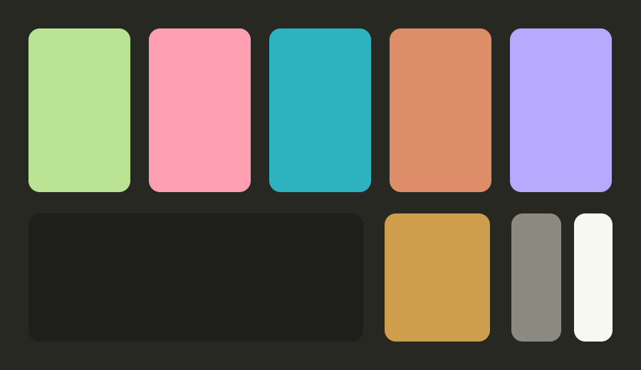
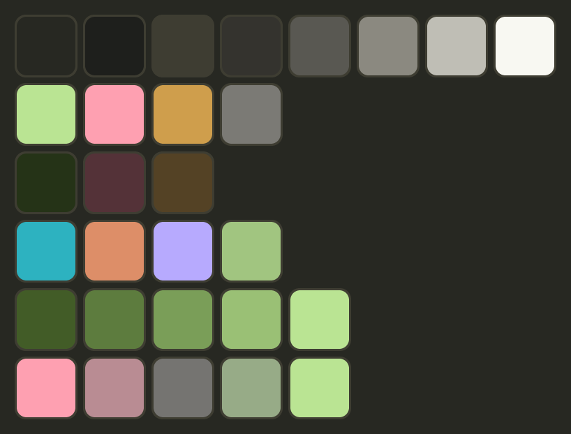

# Monokai dashboard palette

The dark palette the Looker Studio habits pages are built from. **Chalk on a
blackboard**: Monokai's hues, pulled up into a pale, low-chroma band so nothing
outshouts anything else, on the Monokai background you already know.

Companion to [`9009-dashboard-palette.md`](9009-dashboard-palette.md), which is
the light build. Same method, same checks, different mode. Don't mix them on one
page.

**The deployed report deviates from this spec** — it runs a brighter, more
saturated set closer to canonical Monokai. That is recorded, measured and
reviewed in [As built](#as-built--what-actually-shipped). Read it before
reconciling anything.

## The role mapping

Google's theme extractor read the reference image and assigned colours by
frequency, which put purple on `done` and green on `pending`. Roles here are
assigned by **meaning**:

| Role | Google gave it | This palette | Why |
| --- | --- | --- | --- |
| `done` | purple | **chalk green** `#bae493` | Green is the success hue; it is also the page's dominant state |
| `pending` | green | **chalk gold** `#cf9e4c` | Warm = waiting on you. Green can't mean two things |
| `missed`, alerts | red | **chalk pink** `#fea0b1` | Red stays reserved for bad news, and reads at 8.58:1 |
| Section identity | — | cyan, apricot, lilac, sage | Purple isn't discarded — it does identity work instead |

## What "chalky" actually bought

Every hue angle is Monokai's, untouched. What moved is **chroma**:

| Monokai | L / C | Becomes | L / C | ΔE |
| --- | --- | --- | --- | --- |
| Green `#a9dc76` | 0.836 / 0.142 | `done` `#bae493` | 0.870 / 0.115 | **4.3** |
| Red `#ff6188` | 0.706 / 0.194 | `missed` `#fea0b1` | 0.805 / 0.113 | 12.7 |
| Yellow `#ffd866` | 0.894 / 0.139 | `pending` `#cf9e4c` | 0.729 / 0.115 | 16.8 |
| Blue `#78dce8` | 0.838 / 0.095 | `cat-1` `#2db2c0` | 0.701 / 0.110 | 13.8 |
| Orange `#fc9867` | 0.774 / 0.136 | `cat-2` `#dd8e68` | 0.719 / 0.110 | 6.1 |
| Purple `#ab9df2` | 0.741 / 0.121 | `cat-3` `#b7aafe` | 0.780 / 0.119 | **4.0** |

**Chroma spread collapses from 0.098 to 0.009.** Every accent now sits between
C 0.110 and C 0.119 — the same paint thickness, hue after hue. That is the
flattening, and it is the whole reason the page stops feeling jumpy. Mean
relative saturation (C/L) drops from Monokai's 0.176 to 0.149.

**Lightness spread barely moves** (0.188 → 0.169), and that is not an oversight.
Lightness is the only channel that survives colour-blindness — see
[Status](#status) — so it is the one thing a chalk palette cannot flatten.
Chalkiness is bought in chroma; separation is paid for in lightness. Trying to
flatten both is what makes desaturated palettes fail.

Two of these steps are *closer* to real Monokai than the previous, darker build
was: green ΔE 4.3 against 17.3, purple 4.0 against 13.1. Going pale moved the
palette toward Monokai, not away from it.

### Contrast, which is what you actually feel

| | Previous build | Chalk build |
| --- | --- | --- |
| Accent contrast on card | 3.36 – 5.69:1 | **6.42 – 11.52:1** |
| Mean C/L (relative saturation) | 0.225 | **0.149** |
| Chroma spread across accents | 0.065 | **0.009** |

Every accent now clears the 4.5:1 *text* floor, not just the 3:1 mark floor. The
dark mustard that the previous build was forced into is gone.

## Why the raw Monokai theme could not just be extracted

Canonical Monokai's six accents, scored as a set: **worst all-pairs CVD ΔE 3.0**,
green `#a9dc76` against yellow `#ffd866`. To a deuteranope those are one colour —
and that is exactly the pair this dashboard most needs to separate.

Monokai's hue angles are the fixable part: the **Pro** variant puts yellow at
H 90 and green at H 131 (40° apart) where the classic set puts them 24° apart.
This palette uses the Pro angles, then still has to spend lightness on top.

## Surfaces and ink

| Token | Hex | Role | Contrast on card |
| --- | --- | --- | --- |
| `--qs-page` | `#272822` | Page background (canonical Monokai) | — |
| `--qs-card` | `#1e1f1c` | Card / chart surface, a recessed well | 1.00 |
| `--qs-border` | `#3e3d32` | Card borders, dividers (Monokai selection) | 1.51:1 |
| `--qs-grid` | `#34332e` | Gridlines — must stay recessive | 1.31:1 |
| `--qs-axis` | `#595852` | Axis lines, ticks | 2.32:1 |
| `--qs-ink` | `#f8f8f2` | Primary text (Monokai foreground) | **15.54:1** |
| `--qs-ink-2` | `#bfbeb5` | Secondary text, axis labels | **8.87:1** |
| `--qs-ink-3` | `#8b8980` | Muted captions, dimmed stat numbers | **4.72:1** |

**Cards are darker than the page, not lighter.** Charts sit in wells, which is
what buys the marks their contrast, and the page keeps the Monokai background
people recognise.

`--qs-ink-3` is the fix for the greyed-out numbers. Monokai's own comment grey
`#75715e` measures **3.38:1** — under the 4.5:1 text floor, which is why the "15"
and "12" stat tiles read as switched off rather than as data. `#8b8980` is the
same grey lifted to 4.72:1. Nothing on the page renders text below it.

The chalk band tops out at 11.52:1, deliberately short of the ink's 15.54:1.
Text stays the brightest thing on the page, and marks stay clear of the
white-on-black range where light colours halate.

## Status

| Status | Fill | Ink on fill | Mid (dot) | Mid on card |
| --- | --- | --- | --- | --- |
| `done` | `#253317` | 12.59:1 | `#bae493` | **11.52:1** |
| `missed` | `#543238` | 10.42:1 | `#fea0b1` | **8.58:1** |
| `pending` | `#544225` | 9.02:1 | `#cf9e4c` | **6.82:1** |
| `not_due` | *none — bare card* | 15.54:1 | `#7b7a75` | 3.85:1 |

Gauge fill: `#bae493`. Negative deltas and breached targets take `#fea0b1` —
the `missed` pink doubles as the alert colour now that it reads at 8.58:1, so
there is no separate alert token to keep in sync.

**The fills are whispers, and that is the point.** They sit at C 0.05 and
1.23–1.72:1 against the card — far too quiet to be the signal, scoring only CVD
ΔE 5.1 against each other. Identity is carried by the dot (CVD ΔE 8.6) and the
`status` text column; the fill is a third, redundant hint. In the previous build
the fills were the loudest thing on the page, which inverted the hierarchy — the
chalk is supposed to be the bright part.

**`not_due` has no fill on purpose.** Four dark tints cannot be told apart; three
barely can. A `not_due` row is identified by sitting on the bare card, which is a
stronger signal than a fourth muddy brown.

**Why the gold is darker than the rest.** `pending` sits at L 0.729 while `done`
sits at 0.870. Under deuteranopia green and yellow collapse onto the same axis
regardless of hue angle, so lightness is the only channel left — and this is the
finding that shapes the whole palette:

> CVD separation is driven almost entirely by **lightness**, not chroma. At
> ΔL 0.12 the green/gold pair scores CVD ΔE ~12 whether chroma is 0.05 or 0.12.
> Desaturating is nearly free. What chroma buys is the **normal-vision floor**:
> at ΔL 0.12 the same pair scores normal ΔE 12.8 at C 0.05 but 14.9 at C 0.10.

That is why the chalk band sits at C ≈ 0.11 rather than lower. Below ~0.10 the
palette starts failing the floor that protects full-colour readers, and it is
also the validator's chroma floor. C 0.11 at L 0.87 *reads* as pastel — perceived
saturation is roughly C/L — while still clearing both.

`missed` against `not_due` is fine here (CVD ΔE 17.8) because the neutral was
deliberately dropped to L 0.579, well below the chalk band.

## Sequential — the `rate` heatmap

```text
#425c27  →  #5d7c3e  →  #7a9e58  →  #9ac075  →  #bae493
  0–20%       20–40%      40–60%      60–80%      80–100%
```

Monotone lightness, ΔL 0.1075 per step, comfortably above the 0.06 floor. **The
anchor is flipped from the light build**: low values are dark, high values chalk,
so the ramp climbs *out* of the card rather than into it, ending exactly on the
`done` green.

The darkest step is 2.20:1 against the card — above the 2:1 ordinal floor, so a
0% cell still reads as a cell rather than a hole. Leave no-data cells at
`--qs-page` and give cells a 2px gap so the two cases stay distinct.

## Diverging — `status_score` on the week grid

```text
#fea0b1  →  #b98c93  →  #757471  →  #97ab87  →  #bae493
  −1                       0                      +1
 missed                 not due                  done
```

**The midpoint is the dimmest step, not the lightest.** On a dark surface the
neutral zero has to recede toward the card; a light midpoint would make "nothing
happened" the brightest thing on the grid.

Poles at **CVD ΔE 8.6** / 21.1 normal.

## Categorical — `section_name`

Assign in this order and never cycle it:

| Slot | Section | Hex | On card |
| --- | --- | --- | --- |
| 1 | Morning Routine | `#2db2c0` | 6.50:1 |
| 2 | Evening Routine | `#dd8e68` | 6.42:1 |
| 3 | Work Day | `#b7aafe` | 8.04:1 |
| 4 | Daily Reminders | `#a1c580` | 8.53:1 |

### These four slots now carry a second meaning

The same slots 1–4 are reused for the four **life areas** (`work`, `bills-taxes`, `errands`,
`habits`) on the Bills, Errands, Work and Areas pages — see
[`../docs/plans/life-areas.md`](../docs/plans/life-areas.md).

That is acceptable only because the two vocabularies never co-occur in a single chart: the
standing rule is that a chart is coloured by section *or* by status, never both, and no page
plots habit sections beside life areas. The cost is real though — a reader moving between
pages sees the same colour mean two different things, so **label the legend explicitly on
every area chart** rather than relying on colour memory.

**Do not extend the ramp to a fifth slot.** The cap comes from the measured CVD separations
below, not from taste. Four areas fit exactly; a fifth would need the whole ramp re-derived.


Worst adjacent pair CVD ΔE **12.2** / 20.3 normal. The order is doing that work:
slots 2 and 4 (apricot and sage) measure only 5.7 against each other, so the
order deliberately keeps them apart. **Slots 1–3 also clear all-pairs** (CVD 8.7),
which is the cap for scatter, bubble and small-multiples forms — in those, three
sections is the limit and a fourth folds into "Other".

The four sit inside an L range of 0.08. A dead-flat plateau at L 0.78 was
reachable and scored better on adjacent pairs (CVD 12.2, spread 0.00) but
collapsed to CVD 0.7 on all-pairs, which would have banned scatter forms
entirely. The 0.08 of stagger is what buys them back.

`cat-4` is sage at L 0.780, a visibly deeper step than `done` at 0.870, so a
section swatch never impersonates a status dot. The rule that keeps this honest:
**a chart is coloured by section or by status, never both.**

Pink is not in this set. It is reserved for `missed` and alerts, and never
becomes "series 5".

## Validation

```sh
V=path/to/dataviz/scripts/validate_palette.js
node $V "#bae493,#fea0b1,#cf9e4c"           --mode dark --surface "#1e1f1c" --pairs all
node $V "#2db2c0,#dd8e68,#b7aafe,#a1c580"   --mode dark --surface "#1e1f1c"
node $V "#2db2c0,#dd8e68,#b7aafe"           --mode dark --surface "#1e1f1c" --pairs all
node $V "#425c27,#5d7c3e,#7a9e58,#9ac075,#bae493" --mode dark --surface "#1e1f1c" --ordinal
```

| Set | Pairs | CVD ΔE | Normal ΔE | Verdict |
| --- | --- | --- | --- | --- |
| Status mid (3) | all | **8.6** | 21.1 | Clears the ΔE 8 target |
| Categorical (4) | adjacent | **12.2** | 20.3 | Clears it |
| Categorical (3) | all | **8.7** | 17.3 | Clears it |
| Sequential (5) | ordinal | — | — | All ordinal checks pass |
| Diverging poles | all | **8.6** | 21.1 | Clears it |
| Status fills (3) | all | 5.1 | 6.5 | Below floor — see Status |
| Categorical (4) | all | 5.7 | 15.5 | Floor band — slots 2 v 4 |

**One check fails, everywhere, by design: the dark-mode lightness band.**

The validator wants dark-mode marks at L 0.48–0.67. Every chalk step sits at
0.70–0.87. That band is calibrated for a mode where the risk is a mark blowing
out against its surface; the constraint that actually binds on a Monokai card is
**halation** — pale, saturated marks glowing against near-black — and low chroma
is the mitigation for that, which is exactly what this palette has. The ceiling
observed here is 11.52:1, well short of the ink's 15.54:1.

It is worth being clear about what was traded. Holding the band was possible: the
previous build did it, and its accents ran 3.36–5.69:1 with a mustard `pending`
at 3.36:1. Inside L ≤ 0.67 there is **no** three-colour status set on this
surface that clears 4:1 on all three *and* separates green from gold under CVD —
the search returns zero. The band is what was in the way, so the band is what
gave.

Everything else — chroma floor, CVD separation, normal-vision floor, contrast —
passes on every set.

Every value was produced by search — hue held, lightness and chroma varied — and
scored with the validator. Don't hand-edit a hex without re-running it.

## CSS

```css
:root {
	/* surfaces + ink */
	--qs-page: #272822;
	--qs-card: #1e1f1c;
	--qs-border: #3e3d32;
	--qs-grid: #34332e;
	--qs-axis: #595852;
	--qs-ink: #f8f8f2;
	--qs-ink-2: #bfbeb5;
	--qs-ink-3: #8b8980;

	/* status — fills are hints, not the signal; not_due has none */
	--qs-done-fill: #253317;
	--qs-missed-fill: #543238;
	--qs-pending-fill: #544225;

	/* status — mids (dots, marks beside a label) */
	--qs-done: #bae493;
	--qs-missed: #fea0b1;
	--qs-pending: #cf9e4c;
	--qs-not-due: #7b7a75;

	/* alerts reuse the missed pink — no separate token to drift */
	--qs-alert: #fea0b1;

	/* gauge */
	--qs-gauge: #bae493;

	/* categorical — fixed order, never cycled */
	--qs-cat-1: #2db2c0;
	--qs-cat-2: #dd8e68;
	--qs-cat-3: #b7aafe;
	--qs-cat-4: #a1c580;

	/* sequential — rate, dark to chalk */
	--qs-seq-1: #425c27;
	--qs-seq-2: #5d7c3e;
	--qs-seq-3: #7a9e58;
	--qs-seq-4: #9ac075;
	--qs-seq-5: #bae493;

	/* diverging — status_score, dim in the middle */
	--qs-div-neg: #fea0b1;
	--qs-div-neg-2: #b98c93;
	--qs-div-mid: #757471;
	--qs-div-pos-2: #97ab87;
	--qs-div-pos: #bae493;
}
```

## The extraction images



`monokai-palette-extract.png` is the file to hand Looker Studio's
**Theme and layout → Extract theme from image**. It is laid out for the
extractor, not for people: area is the signal, so the page colour is the field,
the card is the single largest block, and the five accents get equal shares. The
ink and muted-grey blocks are there so Looker picks a light text colour rather
than inventing one.

Extraction is a starting point, not the answer — Looker will still assign the
accents in its own order. **Check every slot against the tables above and fix
the ones it got wrong**, particularly the status colours, which it assigns by
dominance and will get backwards.



`monokai-palette-swatches.png` is the human reference: one row per role —
surfaces and ink, status mids, status fills, categorical, sequential, diverging.

Both are produced by
[`generate-palette-images.py`](generate-palette-images.py); the hexes live at the
top of that file. Change them there and re-run:

```sh
python3 analytics/generate-palette-images.py
```

## Applying it in Looker Studio

1. **Theme first.** Report background `#272822`, chart background `#1e1f1c`,
   border `#3e3d32`, font `#f8f8f2`. Theme changes overwrite per-chart styling,
   so anything set before this is lost.
2. **Text.** Titles and labels `#f8f8f2`, axis labels `#bfbeb5`, captions
   `#8b8980`. Nothing on the page wears a series colour as text — the one
   exception is a negative delta, which takes `#fea0b1`.
3. **Today table.** One conditional-formatting rule per status colouring the
   **background** with the three fills. `not_due` gets no rule — it falls
   through to the card. This replaces the blanket highlight that currently
   fires on every row.
4. **Gridlines.** `#34332e` on the spec surface; `#484266` lavender on the
   deployed `#2b2b2b` card. Set this from **Component grid style** — it also
   drives the gauge unless the gauge overrides it per-chart, so do step 5.
5. **Gauge.** Set ranges in the gauge's own Style tab, not from the theme:
   `#076169` → `#21909c` → `#4abfcd`, needle `#bfbeb5`, axis max 19,
   target 16. Cyan is the target hue everywhere on this page.
6. **Calendar heatmap.** The five sequential steps, no-data cells left at
   `#272822`, 2px cell gap.
7. **Week grid.** The diverging ramp with the midpoint pinned to `#757471` —
   Looker defaults it to the data median, which drifts off zero.
8. **Bars and lines.** `#2db2c0` for a single series; slots 2–4 in order only
   when there really are several.

## As built — what actually shipped

The deployed report does **not** use the chalk steps. Extraction plus hand-tuning
landed close to canonical Monokai: brighter, more saturated, less even. That is a
legitimate trade and the reasons for it are recorded below alongside what it
costs, so the next person to touch this knows it was a decision.

> Hexes here are read off screenshots and are approximate. Confirm them in
> **Theme and layout → Edit theme** before relying on the numbers.

| Role | Doc specifies | As built | Contrast (built, on `#2b2b2b`) |
| --- | --- | --- | --- |
| `done` | `#bae493` | ~`#a5d976` | 8.62:1 |
| `pending` | `#cf9e4c` | ~`#ffd866` | 10.29:1 |
| `missed` / alert | `#fea0b1` | ~`#f9527a` | 4.39:1 |
| Accent / target | `#2db2c0` | ~`#2ab5c0` | 5.71:1 |
| Gridlines | `#34332e` (1.31:1) | ~`#d2795a` | **4.47:1** |

Table rows are light fills with dark ink rather than the dark tints in
[Status](#status) — the inverse of the spec, and legible (9–11:1).

**What the brighter set gains:** every accent except the pink reads at 5.7:1 or
better, and the colours are unmistakably Monokai. **What it costs**, measured:

| | Chalk build | As built |
| --- | --- | --- |
| Chroma spread across accents | 0.009 | **0.091** |
| Lightness spread | 0.169 | **0.217** |
| `done` vs `pending` CVD ΔE | 13.9 | **3.8** |
| `done` vs `pending` normal ΔE | 17.4 | **11.9** |

### Observations, worst first

**1. The gridlines are louder than the data.** At ~4.47:1 the salmon grid has
*more* contrast than the pink accent it sits behind (4.39:1). Gridlines are
scaffolding; they should sit around 1.3:1. This is the one finding that damages
every chart on the page, and it is a single dropdown —
**Theme → Component grid style → Grid color**. Looker seeded it from a mid-tone
in the extraction image; nothing chose it deliberately.

**1a. Grid colour and the gauge are the same token.** Looker derives the gauge
arc from **Theme → Component grid style → Grid color**, so one setting serves two
roles that want opposite things — gridlines must recede (~1.3:1), a gauge arc is
data (≥3:1). No single hex satisfies both, and picking for the gauge is what put
the gridlines at 4–6:1.

**Resolution: decouple them.** The gauge gets its ranges from its own Style tab,
and the theme grid is then chosen on gridline merit alone.

**Chosen: lavender grid, cyan gauge.** Kept on looks, and the cyan turns out to
be the semantically right call — cyan already means *target* everywhere else on
this page (the target lines, the "On Target" label), and the gauge is the one
chart whose entire job is distance-to-target. That hue was doing the right work
already; the gauge just joins it.

The lavender is the knob. Same hue throughout, so this is purely how loud the
scaffolding is:

| Grid | On `#2b2b2b` | |
| --- | --- | --- |
| `#a99bf0` | 5.82:1 | as built — louder than the pink accent in front of it |
| `#867ac3` | 3.77:1 | still competing |
| `#6e698f` | 2.75:1 | visible, no longer shouting |
| `#484266` | **1.51:1** | recessive — the gridline band |
| `#3b3557` | 1.24:1 | nearly invisible |

`#484266` keeps the lavender look and lets the bars come forward; `#6e698f` is
the compromise if that reads too faint on a real screen. Anything at or above
`#867ac3` puts the scaffolding in front of the data.

**1b. Gauge — cyan, set per-chart.**

| Range | Hex | On `#2b2b2b` |
| --- | --- | --- |
| low | `#076169` | 1.97:1 |
| mid | `#21909c` | 3.73:1 |
| at target | `#4abfcd` | 6.49:1 |
| needle / target tick | `#bfbeb5` | 7.58:1 |

ΔL 0.15 per step, well clear of the 0.06 floor, and the top step sits ΔE 3.8 from
the `#2ab5c0` target line — close enough to read as the same idea, which is the
point. Dim far from target, bright cyan on it.

The `low` step at 1.97:1 is deliberately quiet: on a gauge the empty arc is
background, not data. The needle takes ink, never an accent — it marks a
position, it is not a category.

**2. Pink is doing series duty.** "Performance by Habit" draws every bar in the
alert pink, and so do the Monthly Trend line, "Still Open 15" and "Remaining to
Target 12". Those are neutral magnitudes — a count of open habits is not an
alert. Painting them red says *everything is bad* when the chart is just showing
values. Status colours are reserved: a series that means good/bad wears them, a
series that is just a number does not. Give those the teal (`#2ab5c0`), and keep
pink for the `-78.9%` delta and the `missed` series in Daily Breakdown, where it
is doing real work.

**3. `done` and `pending` are one colour to a deuteranope** — CVD ΔE 3.8, and
normal ΔE 11.9 is under the 15 floor too. This is exactly the green/yellow
collapse warned about [above](#why-the-raw-monokai-theme-could-not-just-be-extracted),
now live in the Today table where done and pending rows sit adjacent.

It is **already mitigated**, which is why this is third and not first: every row
carries a `Status` text column reading "done" / "pending". Keep it. The
consequence to accept is that the row colour is now decoration rather than
information — pleasant, not load-bearing. If that column is ever dropped, or the
Weekly Cadence grid is read on colour alone, the fix is to darken `pending`
toward `#cf9e4c`, which is the whole reason that step is dark.

**4. Looker invented most of the chart palette.** The extraction image supplies
roughly the first seven slots — slots 2, 3, 4, 6 and 7 are recognisably the
green, teal, lilac, gold and apricot from this palette. Slots 8 onward (a brick
red, a khaki, a blue, a magenta) are Looker's own filler, from no system at all.
Any chart that reaches an eighth series gets a colour nobody chose. Relevant
when the series get edited: keep charts at four or fewer, or set those slots by
hand from the categorical table.

**5. Stat labels wear an accent.** "Completion Rate", "Completed This Week",
"Missed" and "On Target" render in the teal. Labels are text and belong in ink —
`#bfbeb5` — with colour reserved for marks. Same class of mistake as (2): an
accent spent on something that carries no identity. The teal then means only one
thing, the target line, which is where it earns its keep.

**6. Minor.** Weekly Cadence renders one full-width colour band per habit
because only Monday has data — a chart config artefact, not a palette one.

### If the series get edited

The colours above are workable; the ordering is what needs care. Two rules carry
most of the value: **status colours never paint a neutral series**, and
**gridlines stay under ~1.5:1**. Everything else on this page is taste.
