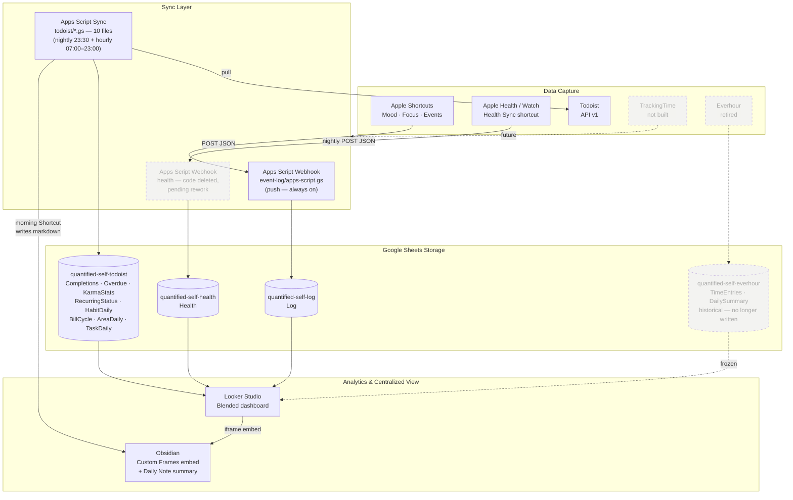
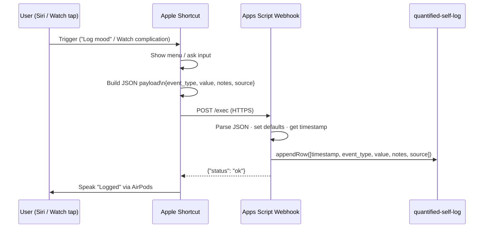
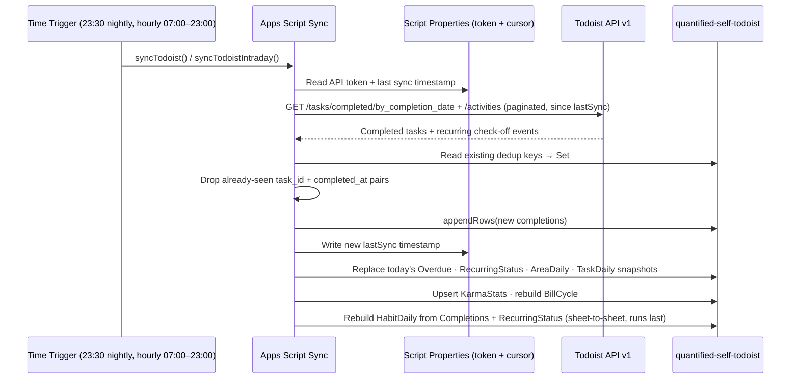
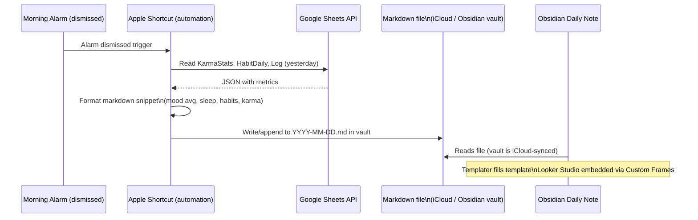

# Architecture Diagrams

Index of what writes what: [sheets.md](sheets.md). The migration off Apps Script is planned in
[plans/typescript-port.md](plans/typescript-port.md).

---

## 1. System Architecture

End-to-end view of all data sources, sync layers, storage, and analytics. Dashed nodes are not
live — Everhour is retired and TrackingTime is not built. Both are covered in
[`../trackingtime/`](../trackingtime/README.md).

---

## 2. Shortcuts Push Pipeline

How a manual event travels from a Siri phrase to a row in Google Sheets.

---

## 3. Todoist Pull Pipeline

How Todoist data is fetched and stored. `syncTodoist()` runs the eight steps in isolation and
aggregates failures, so one dead endpoint cannot abort the rest.

**Ordering is load-bearing.** `HabitDaily` is derived from two other tabs and must run last;
`BillCycle` and `AreaDaily` read `Completions` and so must follow it. `TaskDaily` and
`AreaDaily`'s snapshot columns are *observed only* — a missed day is a permanent hole no re-run
can fill.

A separate morning trigger runs `checkBillRisk()` around 08:00: a 23:30 warning about a bill due
that same day is useless.

---

## 4. Obsidian Integration

How the centralized Obsidian view is populated each morning.

The morning summary previously read `DailySummary` for hours worked. That tab is no longer
written — see [`../shortcuts/morning-summary.md`](../event-log/shortcuts/morning-summary.md), which needs
the same correction once a time tracker is back in place.
