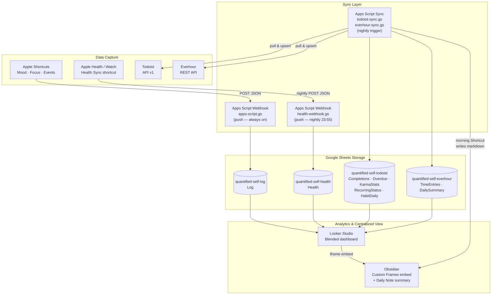
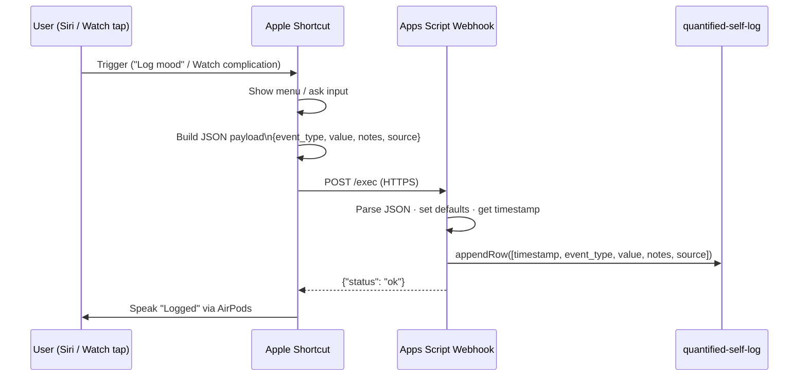
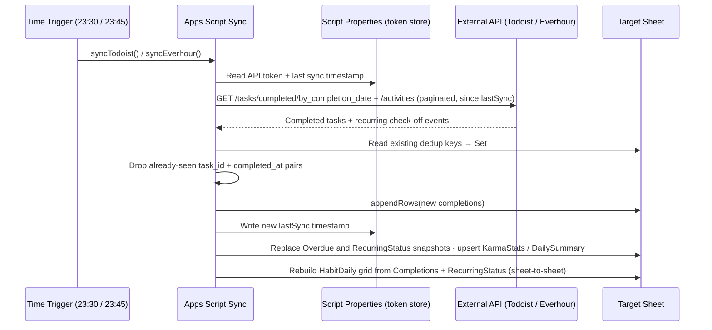
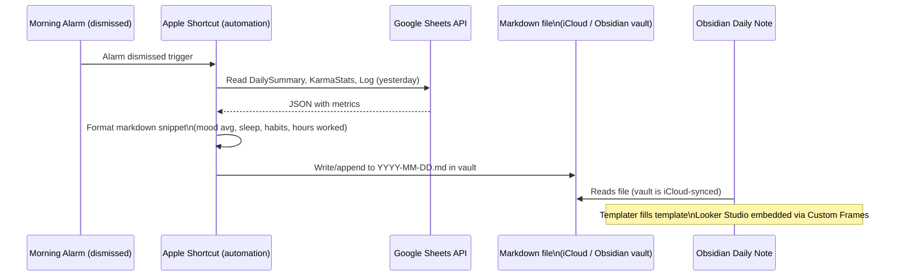

# Architecture Diagrams

---

## 1. System Architecture

End-to-end view of all data sources, sync layers, storage, and analytics.

---

## 2. Shortcuts Push Pipeline

How a manual event travels from a Siri phrase to a row in Google Sheets.

---

## 3. Todoist / Everhour Nightly Pull Pipeline

How external productivity data is fetched and stored each night.

---

## 4. Obsidian Integration

How the centralized Obsidian view is populated each morning.

