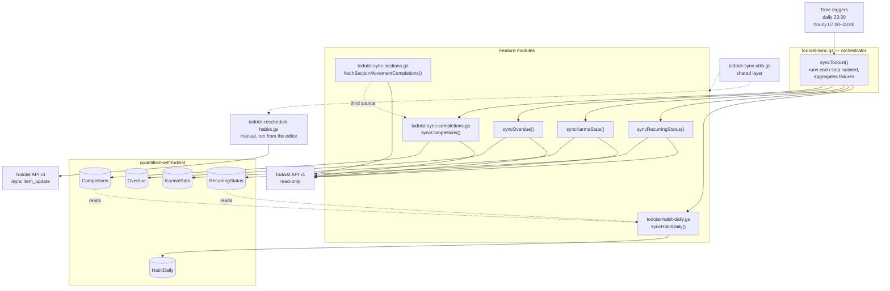

# Todoist Sync — Architecture

Structural reference for the six scripts in [`sheets/todoist/`](../../sheets/todoist/).
Written to be read by someone porting this functionality to another language or
framework: what the modules are, what they talk to, what state they keep, and which
behaviours are load-bearing rather than incidental.

Column-level detail — and the per-tab data semantics a port must reproduce — lives in the
schema docs indexed by [`sheets/todoist/README.md`](../../sheets/todoist/README.md) and is
not repeated here.

---

## 1. Runtime model

All six `.gs` files are **one Google Apps Script project**, not six modules. Apps Script
concatenates them into a single flat global scope before execution.

| Property | Consequence |
| --- | --- |
| No imports, no exports | `todoist-habit-daily.gs` calls `localDateString()` from `todoist-sync-utils.gs` purely because both are globals. File boundaries are organisational only. |
| Load order is not guaranteed | Nothing may depend on another file's *top-level* execution order. Cross-file calls are safe only inside function bodies. |
| Top-level code runs on every invocation | `TODOIST_TOKEN` / `TODOIST_SPREADSHEET_ID` are read at the top of `todoist-sync.gs` on *every* execution of the shared project — including unrelated entry points such as `syncEverhour()`. They therefore only ever **read**; validation is deferred into `syncTodoist()`, which throws. |
| Single V8 runtime, 6-minute execution cap | The batching, windowing, and range-at-a-time sheet writes throughout exist to stay under this limit. |

A port to any language with a real module system should treat the file split below as the
intended module boundaries — they are already clean, just not enforced.

---

## 2. Module map

Two things the diagram is meant to make obvious:

- **`HabitDaily` is derived, not fetched.** The nightly rebuild makes no API calls; it
  reads the `Completions` and `RecurringStatus` tabs, and must therefore run last. The
  one exception is the manual `synthesizeHabitDailyHistory()`, which fetches the live
  habit list once — `added_at` exists nowhere else.
- **Only one module writes to Todoist.** Everything in the nightly sync is read-only. The
  sole write path is `todoist-reschedule-habits.gs`, which is manual.

---

## 3. Main functions per file

Entry points and core logic only; helpers are omitted.

### `todoist-sync.gs` — orchestrator + three tabs

| Function | Role |
| --- | --- |
| `syncTodoist()` | Trigger entry point. Runs the five steps in isolation so one failing endpoint cannot abort the rest, collects errors, and throws a combined message at the end so failures surface in the execution dashboard. |
| `syncTodoistIntraday()` | Hourly entry point. A no-op outside 07:00–23:00 script-local, otherwise `syncTodoist()`. Apps Script hourly triggers cannot be limited to part of the day, so the window is enforced in code. |
| `syncOverdue()` | Writes `Overdue` from `/tasks/filter?query=overdue`. |
| `syncKarmaStats()` | Writes `KarmaStats` from the productivity-stats endpoint. |
| `syncRecurringStatus()` | Writes `RecurringStatus` from `/tasks/filter?query=recurring`. |
| `testTodoist()` | Diagnostic. Probes each endpoint with `limit=1`, logs the response shape, and reports project/recurring/complexity distribution. Run once after setup. |

### `todoist-sync-completions.gs` — the `Completions` tab

| Function | Role |
| --- | --- |
| `syncCompletions()` | Merges three sources, drops rows already present, appends, then advances the persisted cursor. |
| `fetchOneOffCompletions()` | Source 1 — `/tasks/completed/by_completion_date`. Returns full task objects. |
| `fetchRecurringCompletions()` | Source 2 — `/activities` filtered to `is_recurring`. Recurring check-offs appear *only* here. |

### `todoist-sync-sections.gs` — "In Review" source

| Function | Role |
| --- | --- |
| `fetchSectionMovementCompletions()` | Source 3. Returns every task currently sitting in an "In Review" section of a target project, shaped like a completion event. A **state snapshot**, not an event stream — see [`schema/completions.md`](../../sheets/todoist/schema/completions.md#in-review). |

### `todoist-habit-daily.gs` — the `HabitDaily` grid

| Function | Role |
| --- | --- |
| `syncHabitDaily()` | Nightly. Rebuilds a trailing 7-day window. |
| `backfillHabitDaily()` | One-time / on demand. Same logic over ~400 days. |
| `rebuildHabitDaily(days)` | Core, shared by both. Reads `RecurringStatus` as the spine and `Completions` as the truth, then replaces the window's rows. An empty tab widens the window to the full backfill span on its own. |
| `habitDayStatus(date, wasCompleted, today)` | The verdict rule for one habit-day — `done` / `pending` / `missed` / `not_due` — used by the rebuild and the synthesizer alike. A day still in progress is `pending`, never a miss. |
| `synthesizeHabitDailyHistory()` | One-time / re-runnable. Reconstructs the pre-spine grid (before 2026-08-10) from `Completions` plus each habit's `added_at`, inserted above the observed rows. Blank `due_date` marks a row as synthetic. Ends by re-running the backfill so the observed streaks continue the synthetic ones. |
| `nextStreak(prev, status)` | One step of a habit's streak: `done` increments, `missed` resets, `pending`/`not_due` carry. |
| `dueTimeOf(recurrence)` | Parses `"HH:mm"` out of a recurrence rule (`every workday at 8:30 pm` → `20:30`), `""` when it has no time. |
| `diagnoseHabitDailySources()` | Read-only. Logs how far back each source tab reaches and how much of `RecurringStatus` carries the `habits` label — the answer to "why does my grid start on date X". |

Exists because `Completions` is an event log — it contains only the days a habit *was*
done — and Looker Studio has no cross join and no calendar generator, so missed days have
no row to render. This tab supplies the dense habit × day grid.

### `todoist-reschedule-habits.gs` — manual write-back

| Function | Role |
| --- | --- |
| `rescheduleAllHabits()` | Runs all four sections. |
| `rescheduleMorningRoutine()` / `rescheduleWorkDay()` / `rescheduleEveningRoutine()` / `rescheduleDailyReminders()` | Per-section entry points. |
| `rescheduleHabitSection(plainName)` | Core. Finds skipped habits, moves each habit and its steps as one unit, and catches up stragglers. |

### Write targets and idempotency

Each tab uses a different strategy. A rewrite must preserve these — they are what make
re-runs safe.

| Tab | Strategy | Key |
| --- | --- | --- |
| `Completions` | Incremental append | `task_id \| completed_at`, plus a persisted cursor |
| `Overdue` | Full replace of today's rows | `snapshot_date` (state, not an event log) |
| `KarmaStats` | Upsert in place | `date` |
| `RecurringStatus` | Append one row per recurring task per day | `snapshot_date \| task_id` |
| `HabitDaily` | Rebuild a trailing window from scratch (full span when the tab is empty) | `date \| task_id` |

---

## 4. Shared utility layer

`todoist-sync-utils.gs` is infrastructure, not a feature. It provides:

- **HTTP** — a GET that fails legibly when the response is not JSON, and a POST to the v1
  `/sync` endpoint that surfaces per-command failures without throwing on a partial batch.
- **Pagination** — cursor-following over v1 list endpoints, with the safeguards in §7.
- **Caching** — project and section id→name maps in `CacheService` for 6 hours.
- **Persistent state** — sync cursor and "In Review" membership in Script Properties,
  plus a manual cursor reset.
- **Formatting and dedup** — date formatting in both UTC and script-local form, local-day
  derivation, label and duration parsing, complexity extraction, and the existing-key
  readers used for dedup.

Any port needs an equivalent of all five before a single feature module can be moved.

---

## 5. External contract

What a rewrite must talk to.

**Todoist API v1** — base `https://api.todoist.com/api/v1`. REST v2 and Sync v9 were shut
down in early 2026 and now return a non-JSON deprecation notice.

| Endpoint | Used by |
| --- | --- |
| `/projects`, `/sections` | Cached id→name lookups |
| `/tasks` | Live task enrichment |
| `/tasks/filter` | Overdue, recurring, and target-project queries; the history synthesizer's `@habits` lookup |
| `/tasks/completed/by_completion_date` | One-off completions |
| `/activities` | Recurring check-offs |
| `/tasks/completed/stats` ∥ `/user/stats` | Karma (first one that answers) |
| `/sync` (`item_update`) | **The only write.** Reschedule module only. |

**Persistent state**

| Key | Store | Purpose |
| --- | --- | --- |
| `TODOIST_TOKEN` | Script Properties | Bearer token |
| `TODOIST_SPREADSHEET_ID` | Script Properties | Target spreadsheet |
| `TODOIST_LAST_SYNC` | Script Properties | Completions cursor |
| `TODOIST_IN_REVIEW_PREV` | Script Properties | Previous In Review membership |
| `TODOIST_PROJECT_MAP` | CacheService, 6h | id→name |
| `TODOIST_SECTION_MAP` | CacheService, 6h | id→name |

**Schedule** — two time-based triggers: `syncTodoist()` daily at 23:30 (the run that
finalises the day) and `syncTodoistIntraday()` hourly, which self-limits to 07:00–23:00.
The intraday run exists so the dashboard's "today" view is live: `HabitDaily` can only
score days the spine has rows for, and the spine is written by this sync.

---

## 6. Migration notes

The Apps Script couplings that need a deliberate replacement, and why each matters:

| Coupling | Replacement concern |
| --- | --- |
| `PropertiesService` | Any key-value store. Trivial, but note the cursor write ordering in §7. |
| `CacheService` | **100KB per-value cap.** This is already why the live task map is rebuilt per run instead of cached — a full task list exceeds it. |
| `SpreadsheetApp` | The sheet *is* the database. Range read/write and row-deletion semantics are load-bearing, not an implementation detail. |
| `Session.getScriptTimeZone()` + `Utilities.formatDate` | Timezone handling is **not cosmetic**. `completed_at` is stored UTC; an evening habit in a UTC-behind zone files a day late if formatted as UTC. The codebase deliberately keeps two formatters: `toDateString()` (UTC) and `localDateString()` (script timezone). Any port must preserve that distinction. |
| Time-based triggers | Cron or a scheduler. |
| 6-minute execution limit | Shapes batching and windowing throughout. A platform without the limit can simplify, but should do so knowingly. |

---

## 7. Edge cases and known limitations

Most of this was discovered by testing against the live API rather than by reading the
docs. A reimplementation that misses these compiles cleanly and corrupts data quietly.

**Per-tab behaviour lives with the tab.** Each schema doc below carries an exhaustive
"Behaviour and edge cases" table for its own tab — read them; they are not optional colour.
Only the two cross-cutting cases, belonging to no single tab, remain in this section.

| Tab | Edge cases documented in |
| --- | --- |
| `Completions` (including the In Review source) | [`schema/completions.md`](../../sheets/todoist/schema/completions.md#behaviour-and-edge-cases) |
| `Overdue` | [`schema/overdue.md`](../../sheets/todoist/schema/overdue.md#behaviour-and-edge-cases) |
| `KarmaStats` | [`schema/karma-stats.md`](../../sheets/todoist/schema/karma-stats.md) |
| `RecurringStatus` | [`schema/recurring-status.md`](../../sheets/todoist/schema/recurring-status.md#behaviour-and-edge-cases) |
| `HabitDaily` | [`schema/habit-daily.md`](../../sheets/todoist/schema/habit-daily.md#behaviour-and-edge-cases) |

Two more cross-cutting documents a port must read alongside them:

- [`history.md`](../../sheets/todoist/history.md) — the dated seams in the stored data
  (2026-08-10 spine start and `completed_due_date` fix; 2026-08-20 UTC→local stamps and the
  recurrence migration). Timezone handling is the one in §6 that produces them.
- [`habits-contract.md`](../../sheets/todoist/habits-contract.md) — the `habits` /
  `sub-habits` label taxonomy, applied at capture time rather than derived in code.

---
### Reschedule habits

| Case | Behaviour | Why it matters |
| --- | --- | --- |
| Grace window | A task must be at least `RESCHEDULE_GRACE_HOURS` (3) past its scheduled time before it counts as skipped. | Comparing dates alone treats an 08:30 task as "due today" at 06:00 and bumps the whole routine before the day has started. |
| Date-only vs datetime due | Date-only dues have no clock to be hours behind, so they go stale only once the day has passed. Floating datetimes are parsed in the script timezone. | Mixing the two comparisons is how tasks land a day early or late. |
| Habit and its steps | Move as **one unit** — the parent decides, the steps follow. | Judged individually they go stale on different clocks: the parent is bumped once the grace window passes while its date-only steps are not stale until the day flips, leaving the steps a day behind and reading as skipped in that night's Overdue snapshot. |
| Orphan steps | A step whose parent is outside the section is promoted to a leader and judged directly. | Nothing in the section can judge it; stranding it on a stale date would be worse than the old per-task behaviour. |
| Undated steps | Left alone. | Giving them a date would silently opt them into the Overdue snapshot. |
| Straggler catch-up | A step behind its parent is caught up even when the parent is healthy. | Finish the routine but leave one box unchecked: Todoist rolls the *parent* forward on completion while the step stays put. The parent looks fine, so nothing else would ever touch that step and it stays overdue indefinitely. |
| Recurrence preservation | Updates go through `/sync` `item_update` with the original recurring `string` retained and only `date` changed. | A flat `due_string` / `due_date` update re-anchors or drops the recurrence entirely. This is the same thing Todoist's own "reschedule" does. |
| Section lookup | Matched by substring. | The emoji prefix (`🌅 Morning Routine`) is then irrelevant. |

### Shared HTTP layer

| Case | Behaviour | Why it matters |
| --- | --- | --- |
| Empty page with `has_more=true` | Pagination breaks on an empty batch, backed by a 50-iteration guard. | Observed on `/activities`, which will otherwise loop indefinitely. |
| `limit=50` | A hard cap, not a preference. | The completed-tasks endpoint silently clamps higher values, which makes pages look complete when they are not. |
| Non-JSON responses | Detected explicitly and re-thrown with the body prefix. | A deprecated endpoint returns a plain-text notice that otherwise surfaces as `Unexpected token 'T'` from `JSON.parse`. |
| `CacheService` value size | 100KB cap. | Why the live task map is rebuilt per run rather than cached. |
