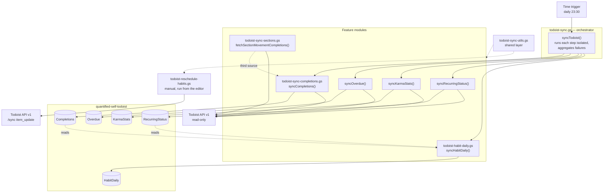

# Todoist Sync — Architecture

Structural reference for the six scripts in [`sheets/todoist/`](../../sheets/todoist/).
Written to be read by someone porting this functionality to another language or
framework: what the modules are, what they talk to, what state they keep, and which
behaviours are load-bearing rather than incidental.

Column-level detail for each sheet tab lives in
[`schema-todoist.md`](../../sheets/todoist/schema-todoist.md) and is not repeated here.

---

## 1. Runtime model

All six `.gs` files are **one Google Apps Script project**, not six modules. Apps Script
concatenates them into a single flat global scope before execution.

| Property | Consequence |
| --- | --- |
| No imports, no exports | `todoist-habit-daily.gs` calls `localDateString()` from `todoist-sync-utils.gs` purely because both are globals. File boundaries are organisational only. |
| Load order is not guaranteed | Nothing may depend on another file's *top-level* execution order. Cross-file calls are safe only inside function bodies. |
| Top-level code runs on every invocation | `TODOIST_TOKEN` / `TODOIST_SPREADSHEET_ID` are read at the top of `todoist-sync.gs` on *every* execution of the shared project — including unrelated entry points such as `syncEverhour()`. They therefore only ever **read**; validation is deferred into `syncTodoist()`, which throws. |
| Single V8 runtime, 6-minute execution cap | The batching, windowing, and range-at-a-time sheet writes throughout exist to stay under this limit. |

A port to any language with a real module system should treat the file split below as the
intended module boundaries — they are already clean, just not enforced.

---

## 2. Module map

Two things the diagram is meant to make obvious:

- **`HabitDaily` is derived, not fetched.** The nightly rebuild makes no API calls; it
  reads the `Completions` and `RecurringStatus` tabs, and must therefore run last. The
  one exception is the manual `synthesizeHabitDailyHistory()`, which fetches the live
  habit list once — `added_at` exists nowhere else.
- **Only one module writes to Todoist.** Everything in the nightly sync is read-only. The
  sole write path is `todoist-reschedule-habits.gs`, which is manual.

---

## 3. Main functions per file

Entry points and core logic only; helpers are omitted.

### `todoist-sync.gs` — orchestrator + three tabs

| Function | Role |
| --- | --- |
| `syncTodoist()` | Trigger entry point. Runs the five steps in isolation so one failing endpoint cannot abort the rest, collects errors, and throws a combined message at the end so failures surface in the execution dashboard. |
| `syncOverdue()` | Writes `Overdue` from `/tasks/filter?query=overdue`. |
| `syncKarmaStats()` | Writes `KarmaStats` from the productivity-stats endpoint. |
| `syncRecurringStatus()` | Writes `RecurringStatus` from `/tasks/filter?query=recurring`. |
| `testTodoist()` | Diagnostic. Probes each endpoint with `limit=1`, logs the response shape, and reports project/recurring/complexity distribution. Run once after setup. |

### `todoist-sync-completions.gs` — the `Completions` tab

| Function | Role |
| --- | --- |
| `syncCompletions()` | Merges three sources, drops rows already present, appends, then advances the persisted cursor. |
| `fetchOneOffCompletions()` | Source 1 — `/tasks/completed/by_completion_date`. Returns full task objects. |
| `fetchRecurringCompletions()` | Source 2 — `/activities` filtered to `is_recurring`. Recurring check-offs appear *only* here. |

### `todoist-sync-sections.gs` — "In Review" source

| Function | Role |
| --- | --- |
| `fetchSectionMovementCompletions()` | Source 3. Returns every task currently sitting in an "In Review" section of a target project, shaped like a completion event. A **state snapshot**, not an event stream — see §7. |

### `todoist-habit-daily.gs` — the `HabitDaily` grid

| Function | Role |
| --- | --- |
| `syncHabitDaily()` | Nightly. Rebuilds a trailing 7-day window. |
| `backfillHabitDaily()` | One-time / on demand. Same logic over ~400 days. |
| `rebuildHabitDaily(days)` | Core, shared by both. Reads `RecurringStatus` as the spine and `Completions` as the truth, then replaces the window's rows. An empty tab widens the window to the full backfill span on its own. |
| `synthesizeHabitDailyHistory()` | One-time / re-runnable. Reconstructs the pre-spine grid (before 2026-08-10) from `Completions` plus each habit's `added_at`, inserted above the observed rows. Blank `due_date` marks a row as synthetic. |
| `diagnoseHabitDailySources()` | Read-only. Logs how far back each source tab reaches and how much of `RecurringStatus` carries the `habits` label — the answer to "why does my grid start on date X". |

Exists because `Completions` is an event log — it contains only the days a habit *was*
done — and Looker Studio has no cross join and no calendar generator, so missed days have
no row to render. This tab supplies the dense habit × day grid.

### `todoist-reschedule-habits.gs` — manual write-back

| Function | Role |
| --- | --- |
| `rescheduleAllHabits()` | Runs all four sections. |
| `rescheduleMorningRoutine()` / `rescheduleWorkDay()` / `rescheduleEveningRoutine()` / `rescheduleDailyReminders()` | Per-section entry points. |
| `rescheduleHabitSection(plainName)` | Core. Finds skipped habits, moves each habit and its steps as one unit, and catches up stragglers. |

### Write targets and idempotency

Each tab uses a different strategy. A rewrite must preserve these — they are what make
re-runs safe.

| Tab | Strategy | Key |
| --- | --- | --- |
| `Completions` | Incremental append | `task_id \| completed_at`, plus a persisted cursor |
| `Overdue` | Full replace of today's rows | `snapshot_date` (state, not an event log) |
| `KarmaStats` | Upsert in place | `date` |
| `RecurringStatus` | Append one row per recurring task per day | `snapshot_date \| task_id` |
| `HabitDaily` | Rebuild a trailing window from scratch (full span when the tab is empty) | `date \| task_id` |

---

## 4. Shared utility layer

`todoist-sync-utils.gs` is infrastructure, not a feature. It provides:

- **HTTP** — a GET that fails legibly when the response is not JSON, and a POST to the v1
  `/sync` endpoint that surfaces per-command failures without throwing on a partial batch.
- **Pagination** — cursor-following over v1 list endpoints, with the safeguards in §7.
- **Caching** — project and section id→name maps in `CacheService` for 6 hours.
- **Persistent state** — sync cursor and "In Review" membership in Script Properties,
  plus a manual cursor reset.
- **Formatting and dedup** — date formatting in both UTC and script-local form, label and
  duration parsing, complexity extraction, and the existing-key readers used for dedup.

Any port needs an equivalent of all five before a single feature module can be moved.

---

## 5. External contract

What a rewrite must talk to.

**Todoist API v1** — base `https://api.todoist.com/api/v1`. REST v2 and Sync v9 were shut
down in early 2026 and now return a non-JSON deprecation notice.

| Endpoint | Used by |
| --- | --- |
| `/projects`, `/sections` | Cached id→name lookups |
| `/tasks` | Live task enrichment |
| `/tasks/filter` | Overdue, recurring, and target-project queries; the history synthesizer's `@habits` lookup |
| `/tasks/completed/by_completion_date` | One-off completions |
| `/activities` | Recurring check-offs |
| `/tasks/completed/stats` ∥ `/user/stats` | Karma (first one that answers) |
| `/sync` (`item_update`) | **The only write.** Reschedule module only. |

**Persistent state**

| Key | Store | Purpose |
| --- | --- | --- |
| `TODOIST_TOKEN` | Script Properties | Bearer token |
| `TODOIST_SPREADSHEET_ID` | Script Properties | Target spreadsheet |
| `TODOIST_LAST_SYNC` | Script Properties | Completions cursor |
| `TODOIST_IN_REVIEW_PREV` | Script Properties | Previous In Review membership |
| `TODOIST_PROJECT_MAP` | CacheService, 6h | id→name |
| `TODOIST_SECTION_MAP` | CacheService, 6h | id→name |

**Schedule** — one daily time-based trigger at 23:30 calling `syncTodoist()`.

---

## 6. Migration notes

The Apps Script couplings that need a deliberate replacement, and why each matters:

| Coupling | Replacement concern |
| --- | --- |
| `PropertiesService` | Any key-value store. Trivial, but note the cursor write ordering in §7. |
| `CacheService` | **100KB per-value cap.** This is already why the live task map is rebuilt per run instead of cached — a full task list exceeds it. |
| `SpreadsheetApp` | The sheet *is* the database. Range read/write and row-deletion semantics are load-bearing, not an implementation detail. |
| `Session.getScriptTimeZone()` + `Utilities.formatDate` | Timezone handling is **not cosmetic**. `completed_at` is stored UTC; an evening habit in a UTC-behind zone files a day late if formatted as UTC. The codebase deliberately keeps two formatters: `toDateString()` (UTC) and `localDateString()` (script timezone). Any port must preserve that distinction. |
| Time-based triggers | Cron or a scheduler. |
| 6-minute execution limit | Shapes batching and windowing throughout. A platform without the limit can simplify, but should do so knowingly. |

---

## 7. Edge cases and known limitations

Most of this was discovered by testing against the live API rather than by reading the
docs. A reimplementation that misses these compiles cleanly and corrupts data quietly, so
this section is exhaustive where the rest of the document is brief.

### Completions

| Case | Behaviour | Why it matters |
| --- | --- | --- |
| Source disjointness | A recurring check-off **never** appears in `/tasks/completed/by_completion_date`; it appears only in `/activities`. | The two sources cannot overlap, which is what removes the need for a fragile cross-endpoint join. |
| `due_date` on an activity event | Already advanced to the **next** occurrence. The occurrence actually completed is `completed_due_date`. | Reading `due_date` dates every habit completion one occurrence into the future — a day for daily habits, a whole weekend for workday ones. |
| Missing fields in `extra_data` | `labels` is omitted entirely for a task that has none. Project arrives as top-level `parent_project_id`, parent as top-level `parent_item_id` — **not** inside `extra_data`. | An empty labels cell is not cosmetic: it silently zeroes the habit count. |
| Live-task enrichment | Backfills fields the event omitted, by reading the task as it exists now. | Sound **only** because recurring tasks survive completion. The same fallback on a one-off completion would read the wrong task or nothing at all. |
| Completion with no `task_id` | Dropped, not stored. | Avoids junk rows that can never be joined. |
| Empty sheet | Cursor is ignored and the full 90-day window is pulled. | Makes "clear the sheet to re-backfill" work. The window is clamped to the API's ~3-month max regardless. |
| Cursor write ordering | `setPrevInReviewIds()` and `setLastSyncTime()` run **after** the row write. | A thrown write is retried next run instead of advancing the baseline and losing rows permanently. |

### In Review

| Case | Behaviour | Why it matters |
| --- | --- | --- |
| Section moves in the event stream | Invisible — `item:updated` carries only content/description deltas, never `section_id`. | This is why In Review is a snapshot diff rather than an event source. The earlier event-based approach filtered on a field that is never present and returned zero rows. |
| First run | Previous set is empty, so every task currently in In Review is backfilled with that day's date. | Delete those rows manually if only true go-forward moves are wanted. |
| Enter and leave between runs | Missed entirely. | Nightly granularity is the ceiling. |
| Leave and re-enter | Counted again. | Intentional, but a rewrite should know it is a choice. |
| `completed_at` | Set to detection time. | The API exposes no actual move timestamp. |

### Overdue and RecurringStatus

| Case | Behaviour | Why it matters |
| --- | --- | --- |
| Date cells read back from Sheets | Returned as `Date` objects once the column is date-formatted, so a raw `===` against `"YYYY-MM-DD"` never matches. | Without the `dateKey()` normaliser the daily replace silently appends on top of the old snapshot instead of replacing it — duplicates, not an error. |
| Sub-habits | Undated by design, so they never reach either tab. | One appearing there means it was given a due date. That is the bug, not the tab. |
| Two completions between runs | RecurringStatus cannot see them — it records state, not events. | Use `Completions` for counting; use this tab to reconstruct state on days the event source came back empty. |
| "Today" stamp before 2026-08-20 | `snapshot_date` (both tabs), `days_overdue`, and `KarmaStats.date` were derived via `toDateString()` — UTC. The 23:30 local trigger is already 05:30 *tomorrow* in UTC, so every nightly row was labeled one day ahead, and `days_overdue` ran one too high. | Fixed to `localDateString()`. Historical rows are not garbage: a snapshot labeled D taken at 23:30 of D−1 is simply the state at the *start* of day D, and every consumer's date comparison tolerates that. The dangling last label self-heals — the replace-today pass overwrites it on the first post-fix nightly run. |

### HabitDaily

| Case | Behaviour | Why it matters |
| --- | --- | --- |
| Completing a habit pushes `due_date` past the day | `wasDue` is `(due_date <= date) OR wasCompleted`. | Without the second clause, every habit actually done reads as "not scheduled" — the inverse of the intended result. |
| Attribution | A completion counts on the **local day it was checked off**, from `completed_at` in the script timezone. | Deliberate: it answers "on which days did I actually do this". The tradeoff is that catching up Monday's habit on Wednesday marks Wednesday, not Monday. |
| Weekend rest days | Saturday/Sunday uncompleted reads `not_due` across **all** history; a weekend check-off still reads `done` with `due = 1` (`isRestDay()`). | Deliberate reinterpretation, not a bug: the habits ran `every day` until 2026-08-20, but the owner's contract never included weekends — charts must not penalize them. |
| 2026-08-20 recurrence migration | Every habit switched `every day` → `every workday`; the two Daily Reminders tasks gained recurrence and enter the grid only from that date. | Pre-migration spine rows keep the old `every day` strings; the weekend rule overrides them by design. Any future *synthesized* pre-Aug-10 spine must apply the same rest-day rule rather than trusting those historical strings. |
| Rescheduled before the snapshot | If the reschedule helper bumps a skipped habit forward before 23:30, that day reads `not_due` rather than `missed`. | **Fails safe** — a miss is dropped, a completion is never invented — but a habitually rescheduled routine will flatter itself. |
| Habits completed between 23:30 and midnight | Land in the following day's data. | The 7-day rebuild window exists precisely so the next run corrects them. A one-day window would lose them. |
| Spine row labeled after today | Skipped by `readHabitSpine()`. | A snapshot cannot observe a day that has not happened — a future label is always a stamping artifact, and rendering one shows tomorrow's habits as pre-emptively `missed` (seen live on 2026-08-20). |
| Ordering | Must run after both `Completions` and `RecurringStatus`. | Running earlier rebuilds today's grid from a spine that has no rows for today. |
| Missing `Completions` tab | Every habit day reads as missed. Logged, no crash. | Degrades loudly rather than silently. |
| Missing `RecurringStatus` tab | No-op with a log line, no tab created. | The spine is checked *before* the tab is created — bailing after `getOrCreateHabitDailySheet()` would leave an empty `HabitDaily` behind that nothing ever fills. |
| Habit naming | Column C stores the title up to the first `" - "`; the untrimmed title is kept in `habit_full`. | Half the habits carry a motivational tagline and half do not, so raw titles make Looker row labels a mix of phrases and sentences. Deriving the short name here avoids renaming tasks and avoids fighting the Habit Tracker app over titles. |
| Layout change | An outdated header causes the whole tab to be cleared, not overwritten. | Existing rows are positional; writing new columns over stale rows would leave silently misaligned data. The grid is derived, so a backfill rebuilds it. |
| Empty tab | The rebuild window auto-widens to `HABIT_DAILY_BACKFILL_DAYS` (400), whatever window was asked for. | Without it, the first nightly run after a layout change would clear the tab and refill only 7 days — history truncated to a week until someone noticed. It also makes a fresh deploy backfill itself. |
| Label matching | Exact token, never substring. | `sub-habits` contains `habits` as a substring, so a naive "contains" test sweeps every checklist step back into the habit count. |
| Window wipe | One contiguous `clearContent()` — not `deleteRows()`, and not row-by-row. | Per-row calls turn a 400-day backfill into a timeout, and `deleteRows()` throws "you can't delete all unfrozen rows" (seen live, in Spanish) the moment the header row is frozen — which a full-window rebuild triggers every time, since all data rows are stale at once. Clearing leaves the grid rows in place; the rewrite lands on top. |
| Coexistence with the nightly sync | Rebuilds key done-ness on `completed_at` (Completions col A) and due-ness on the spine snapshot — never on Completions col J (`due_date`). | Col J carries split semantics (pre/post the Aug-10 `completed_due_date` fix), so reading it would resurrect the bug on every rebuild. The spine's due dates come from `/tasks/filter` snapshots, a pipeline that bug never touched. Completions is the durable completion store — the activity API refill caps at ~90 days, so clearing that tab permanently loses older done-ness. |
| Synthetic history floor | A habit's synthetic window starts at max(`added_at`, first captured completion); zero captures ⇒ skipped entirely. | Recurring capture only began at some point — synthesising earlier days would paint every uncaptured day `missed` (streak poison). Deliberate undercount: misses can be lost, never fabricated. Also keeps out tasks that carry `habits` today but were plain reminders then. |
| Synthetic rows vs rebuilds | `rebuildHabitDaily` clamps its replace boundary to the earliest observed spine day. | Without the clamp, a 400-day backfill would delete the synthetic block while regenerating nothing in its place — the spine has no rows there. The blank `due_date` marks synthetic rows; their section/labels/priority are the habit's current values, not historical ones. |
| Retracted completions | Completions is append-only, so a habit checked off and later unchecked stays `done` for that day. | Rebuilds cannot converge past this — the source itself never forgets. Known and accepted. |

### Reschedule habits

| Case | Behaviour | Why it matters |
| --- | --- | --- |
| Grace window | A task must be at least `RESCHEDULE_GRACE_HOURS` (3) past its scheduled time before it counts as skipped. | Comparing dates alone treats an 08:30 task as "due today" at 06:00 and bumps the whole routine before the day has started. |
| Date-only vs datetime due | Date-only dues have no clock to be hours behind, so they go stale only once the day has passed. Floating datetimes are parsed in the script timezone. | Mixing the two comparisons is how tasks land a day early or late. |
| Habit and its steps | Move as **one unit** — the parent decides, the steps follow. | Judged individually they go stale on different clocks: the parent is bumped once the grace window passes while its date-only steps are not stale until the day flips, leaving the steps a day behind and reading as skipped in that night's Overdue snapshot. |
| Orphan steps | A step whose parent is outside the section is promoted to a leader and judged directly. | Nothing in the section can judge it; stranding it on a stale date would be worse than the old per-task behaviour. |
| Undated steps | Left alone. | Giving them a date would silently opt them into the Overdue snapshot. |
| Straggler catch-up | A step behind its parent is caught up even when the parent is healthy. | Finish the routine but leave one box unchecked: Todoist rolls the *parent* forward on completion while the step stays put. The parent looks fine, so nothing else would ever touch that step and it stays overdue indefinitely. |
| Recurrence preservation | Updates go through `/sync` `item_update` with the original recurring `string` retained and only `date` changed. | A flat `due_string` / `due_date` update re-anchors or drops the recurrence entirely. This is the same thing Todoist's own "reschedule" does. |
| Section lookup | Matched by substring. | The emoji prefix (`🌅 Morning Routine`) is then irrelevant. |

### Shared HTTP layer

| Case | Behaviour | Why it matters |
| --- | --- | --- |
| Empty page with `has_more=true` | Pagination breaks on an empty batch, backed by a 50-iteration guard. | Observed on `/activities`, which will otherwise loop indefinitely. |
| `limit=50` | A hard cap, not a preference. | The completed-tasks endpoint silently clamps higher values, which makes pages look complete when they are not. |
| Non-JSON responses | Detected explicitly and re-thrown with the body prefix. | A deprecated endpoint returns a plain-text notice that otherwise surfaces as `Unexpected token 'T'` from `JSON.parse`. |
| `CacheService` value size | 100KB cap. | Why the live task map is rebuilt per run rather than cached. |
